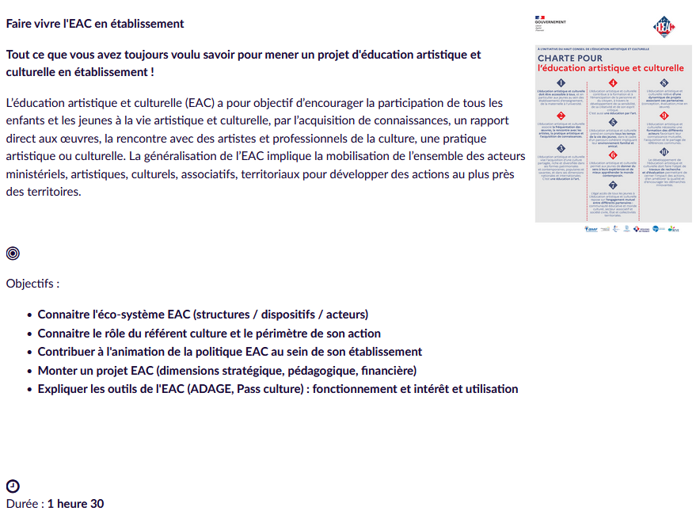

<p align="center">
  
  
  
</p>

# 🔥 Convert-magistere

Outil de conversion et nettoyage de fichiers `.mbz` Moodle (Magistère-friendly).

## Fonctions principales :

- Convertit les activités `label` et `labellud` en `page`
- Nettoie les contenus HTML (`<intro>`, `<content>`) dans tous les modules en retirant tableaux et couleurs
- Corrige les fichiers `files.xml`, `moodle_backup.xml` et `inforef.xml`
- Crée une nouvelle archive `.mbz` compatible avec Moodle
- Mode `.exe` disponible via PyInstaller
- Par défaut le fichier à convertir doit etre nommé `cours.mbz`

---

## 🚀 Utilisation

### Version `.exe` (Windows)

```bash
convert_magistere.exe [--input fichier.mbz] [--debug]
```

### Version Python

```bash
python convert_magistere.py --input fichier.mbz --debug
```

---

## ⚙️ Options

| Option       | Description                                        |
|--------------|----------------------------------------------------|
| `--input`    | Fichier `.mbz` à traiter (défaut : `cours.mbz`)     |
| `--debug`    | Garde le dossier `cours_decompresse` après traitement |

---

## 🏗 Génération du `.exe`

### Étapes :

```bash
pip install pyinstaller
pyinstaller --onefile convert_magistere.py
```

Le `.exe` se trouvera dans `dist/convert_magistere.exe`.

---

## 🛠 Dépendances

```bash
pip install beautifulsoup4 lxml
```

---

**Made with patience, café, et ChatGPT.**

## 🧼 Exemple avant/après nettoyage

### 🟣 Avant (contenu issu de Magistère)


### 🔵 Après nettoyage par `convert-magistere`


ℹ️ Remarque : certains ajustements manuels peuvent être nécessaires, par exemple :

<br>[fa-clock-o fa-lg]
&nbsp;
<p style="text-align: left;">Durée : <strong>1 heure 30</strong>
</p>
code initial :

```bash
<br>[fa-clock-o fa-lg]
&nbsp;
<p style="text-align: left;">Durée : <strong>1 heure 30</strong>
</p>
```

👉 à corriger en :

<p style="text-align: left;">[fa-clock-o fa-lg] &nbsp; Durée : <strong>1 heure 30</strong></p>

code corrigé :
```bash
<p style="text-align: left;">[fa-clock-o fa-lg] &nbsp; Durée : <strong>1 heure 30</strong></p>
```
